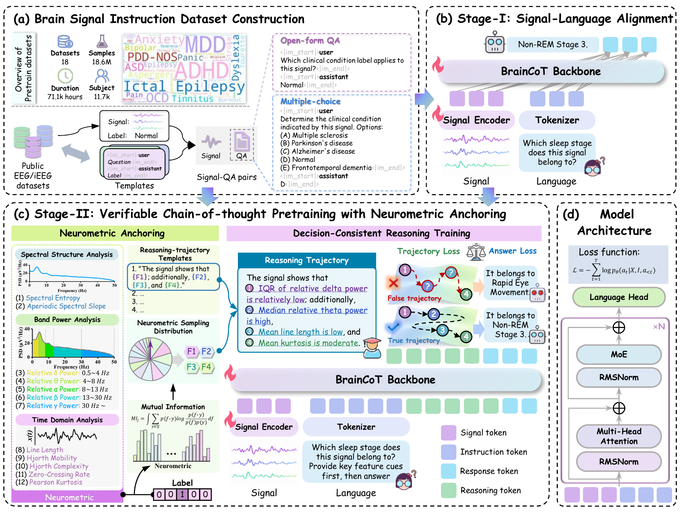

# BrainCoT: A Multi-Task Zero-Shot Brain Signal Foundation Model with Neurometric-Anchored Chain-of-Thought Reasoning

<p align="center">
  <a href="https://github.com/5GYYYYY/BrainCoT/blob/main/LICENSE"></a>
  
  
</p>

> [!IMPORTANT]
> 🎉 **Accepted at NeurIPS 2026 as a Poster.** The research code, pretrained checkpoints, data-processing scripts, and reproduction instructions are currently being organized and will be released soon. Please star or watch this repository for updates.

## Overview

BrainCoT is a multi-task zero-shot brain signal foundation model with **neurometric-anchored chain-of-thought reasoning**. It casts heterogeneous EEG and iEEG tasks into a unified instruction-driven question-answering framework, allowing one pretrained model to handle multiple unseen downstream datasets without target-data-specific adaptation.

Unlike free-form rationales, BrainCoT grounds its reasoning supervision in measurable signal properties. Its neurometric evidence includes spectral, band-power, and time-domain descriptors, providing an externally checkable basis for the generated reasoning trajectory.

## Highlights

- **Multi-task zero-shot inference:** directly handles diverse brain-signal tasks through natural-language instructions, without downstream training data.
- **Large-scale instruction pretraining:** uses approximately **18.6 million** signal-QA pairs from **18 public EEG/iEEG datasets**, covering about **71.1k hours** and **11.7k subjects**.
- **Verifiable reasoning:** constructs chain-of-thought supervision from neurometric evidence extracted from the input signal rather than unconstrained language-model rationales.
- **Decision-consistent training:** aligns reasoning trajectories with correct answers to reduce template imitation and rationale-answer mismatch.
- **Strong zero-shot performance:** achieves an average **67.41% ACC** and **74.33% AUC** across 12 downstream datasets.

## Method

<p align="center">
  
</p>

BrainCoT follows a three-part pipeline:

1. **Brain Signal Instruction Dataset Construction**  
   Labeled EEG/iEEG samples are converted into signal-instruction-answer triples using task-specific open-form and multiple-choice templates.

2. **Stage I: Signal-Language Alignment**  
   A signal encoder and language tokenizer feed a shared BrainCoT backbone, which learns multi-task instruction following and direct answer generation.

3. **Stage II: Neurometric-Anchored Reasoning**  
   Offline neurometric evidence is used to construct verifiable reasoning trajectories. Decision-consistent rationale training teaches the model to generate evidence-grounded reasoning before producing its answer. At inference time, the model generates both the reasoning trajectory and answer directly from the signal and instruction; no externally computed neurometric features are required.

## Main Results

BrainCoT is evaluated in a zero-shot setting on 12 downstream EEG/iEEG datasets. No target-dataset samples are used for adaptation.

| Setting | Training data on downstream datasets | Average ACC | Average AUC |
|:--|:--:|--:|--:|
| BrainCoT zero-shot | 0% | **67.41** | **74.33** |

Compared with the strongest baseline using 1% labeled downstream data for linear probing, BrainCoT improves average ACC by **3.85 percentage points** and average AUC by **5.97 percentage points**.

## Planned Release

The public release is expected to include:

- model architecture and configuration files;
- Stage I and Stage II training pipelines;
- dataset preprocessing and instruction-construction scripts;
- zero-shot, linear-probing, and fine-tuning evaluation code;
- pretrained checkpoints and example inference scripts;
- environment setup and reproduction documentation.

The repository currently serves as the official project page while these materials are being cleaned, documented, and verified.

## Citation

BrainCoT has been accepted as a Poster at NeurIPS 2026. The complete author list, paper link, and proceedings metadata will be added when the camera-ready paper becomes publicly available. In the meantime, please cite the repository as:

```bibtex
@misc{braincot2026,
  title  = {BrainCoT: A Multi-Task Zero-Shot Brain Signal Foundation Model with Neurometric-Anchored Chain-of-Thought Reasoning},
  year   = {2026},
  note   = {Accepted as a Poster at NeurIPS 2026. Code forthcoming},
  url    = {https://github.com/5GYYYYY/BrainCoT}
}
```

## License

This project is released under the [MIT License](LICENSE). Dataset access and use remain subject to the licenses and terms of their original providers.
